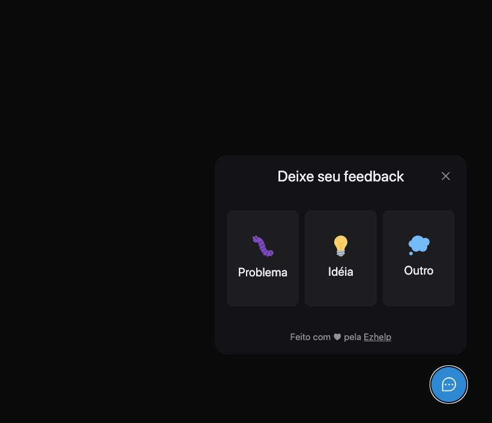

<h1 align="center">FeedGet - Sending feed backs</h1>

  <a href="#-padrões-e-princípios">Padrões e Princípios</a>&nbsp;&nbsp;&nbsp;|&nbsp;&nbsp;&nbsp;
  <a href="#-tecnologias">Tecnologias</a>&nbsp;&nbsp;&nbsp;|&nbsp;&nbsp;&nbsp;
  <a href="#-como-executar">Como executar</a>&nbsp;&nbsp;&nbsp;|&nbsp;&nbsp;&nbsp;
  <a href="#-licença">Licença</a>

  

## ✨ Padrões e Princípios

Esse projeto foi desenvolvido com os seguintes Pattern e Design:

- Clean architecture
- Service
- Repository
- IoC
- Decorator

Princípios SOLID:

- Dependency inversion principle
- Single-responsibility principle

## ✨ Tecnologias

Esse projeto foi desenvolvido com as seguintes tecnologias:

- [TypeScript](https://www.typescriptlang.org/)
- [Express](https://expressjs.com/pt-br/)
- [Prisma](https://www.prisma.io/)

## 🚀 Como executar a API

- Clone o repositório e acesse a pasta;
- Instale os packages `yarn`;
- Execute o docker-compose `docker-compose up -d`;
- Executa as migrations com `yarn prisma migrate dev`;
- Inicie o servidor de teste `yarn start:dev`;
- Servidor vai rodar na porta `http://localhost:3333`;

## 🚀 Como executar a Interface Web

- Acesse a pasta Web;
- Instale os packages `yarn`;
- Inicie o servidor com `yarn dev`;
- Acesse o `http://localhost:3000/`

## 📄 Licença

Esse projeto está sob a licença MIT. Veja o arquivo [LICENSE](LICENSE) para mais detalhes.

---

Feito com ♥ by @joaocprofile 👋🏻 &nbsp;
